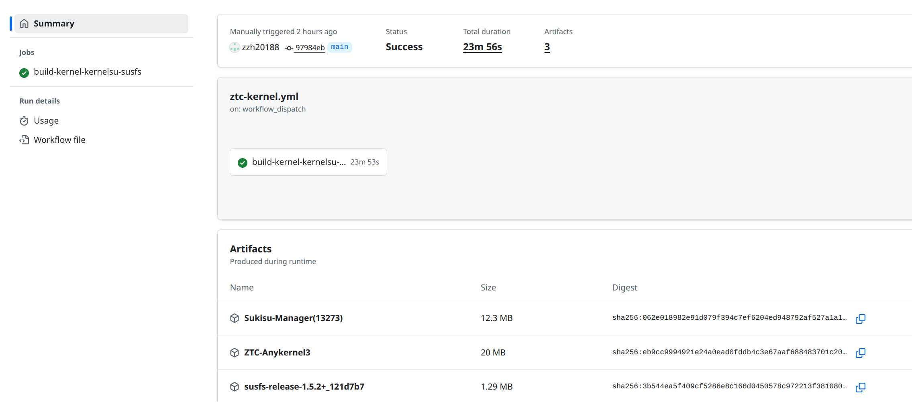
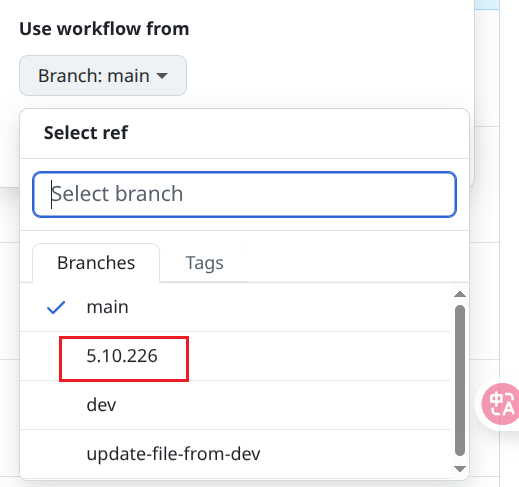

  <!-- 项目 Logo: 采用了 Google Actions for Android 的官方图标，完美契合主题 -->
  
  <h1 align="center">ZTC-Kernel-Build</h1>
  
  <!-- Slogan -->
  

    ✨ <strong>专为第三方内核设计的一键云端编译方案。</strong> ✨
  

   

    
    
    
  

  
   

  <!-- 推荐放一张你自己项目 Actions 成功运行并产出 Artifacts 的截图 -->
  

---

<!-- 目录 -->

  
📚 目录

  <ol>
    <li><a href="#-项目简介">项目简介</a></li>
    <li><a href="#-如何使用">如何使用</a></li>
    <li><a href="#-构建产物">构建产物</a></li>
    <li><a href="#-引用与致谢">引用与致谢</a></li>
    <li><a href="#-许可证">许可证</a></li>
  </ol>

---

# 注意
> 因ZTC源码的更新，大幅更改了本项目逻辑；ZTC源码目前内置了BBG和SUSFS、VFS，但是同时也内置了官方KSU，这些是不可逆的。因此再也无法使用SUKISU，但可以在编译时**选择5.10.226分支**，因为这是旧版的源码，仍然可以使用SUKISU，缺点是是旧版的源码。也就是说今后若想使用最新ZTC源码，需要搭配官方版KSU使用

**且因为这些改动，和我个人的设备坏了，今后维护将很困难**

## 🚀 项目简介
本项目提供一个极简的 **GitHub Actions 工作流**，用于全自动编译安卓 GKI 内核，并使用 AnyKernel3 打包成可直接刷入的 `zip` 文件。

---

## ✨ 如何使用

1.  **Fork 本仓库**
    
    点击仓库右上角的 **`Fork`** 按钮，将此项目复制到你自己的 GitHub 账户下。

2.  **启动工作流**

    *   进入你 Fork 后的仓库，点击上方的 **`Actions`** 选项卡。
    *   在左侧边栏选择 **`ZTC Kernel Build`**。
    *   点击右侧的 **`Run workflow`** 下拉按钮。

3.  **确认并运行**
    
    再次点击绿色的 **`Run workflow`** 按钮，即可开始编译。

4.  **下载刷机包**

    等待 Actions 运行完成。成功后，在工作流的摘要页面下方可以找到名为 **`xxxxx-Anykernel3.zip`** 的构建产物。点击它即可下载内核刷入包。

---

## 📦 构建产物

工作流成功运行后，你将得到一个 **AnyKernel3 格式的 `zip` 压缩包**。

1. 你可以直接使用 TWRP 或其他兼容的 Recovery 将此文件刷入你的设备。
2. 你可以直接使用刷写 Anykernel3的软件，给予ROOT后刷入(例如[HorizonKernelFlasher](https://github.com/libxzr/HorizonKernelFlasher/releases))

---

## 🙏 引用与致谢

本项目的实现离不开以下优秀的开源项目，在此表示衷心的感谢！

*   **[ZTC内核](https://android.googlesource.com/kernel/common/)**: ZTC内核开源地址。
*   **[osm0sis/AnyKernel3](https://github.com/osm0sis/AnyKernel3)**: 通用内核刷机包制作工具。
*   **[Clang-r563880](https://android.googlesource.com/platform/prebuilts/clang/host/linux-x86/+/refs/heads/mirror-goog-main-llvm-toolchain-source)**: 谷歌提供预编译好的 Clang 工具链。

---

## 📄 许可证

本项目使用 [MIT](LICENSE) 许可证。